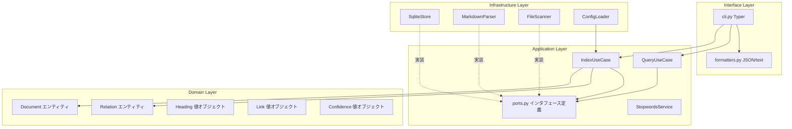
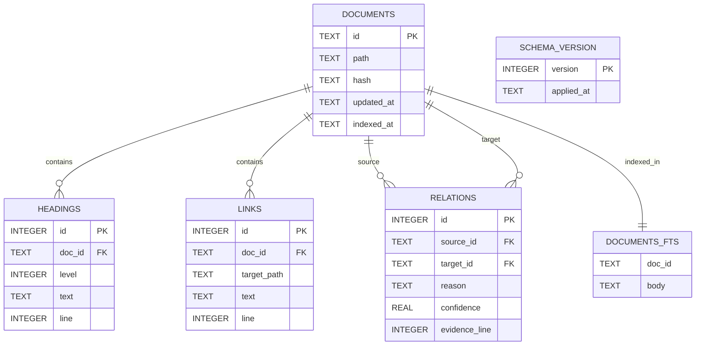
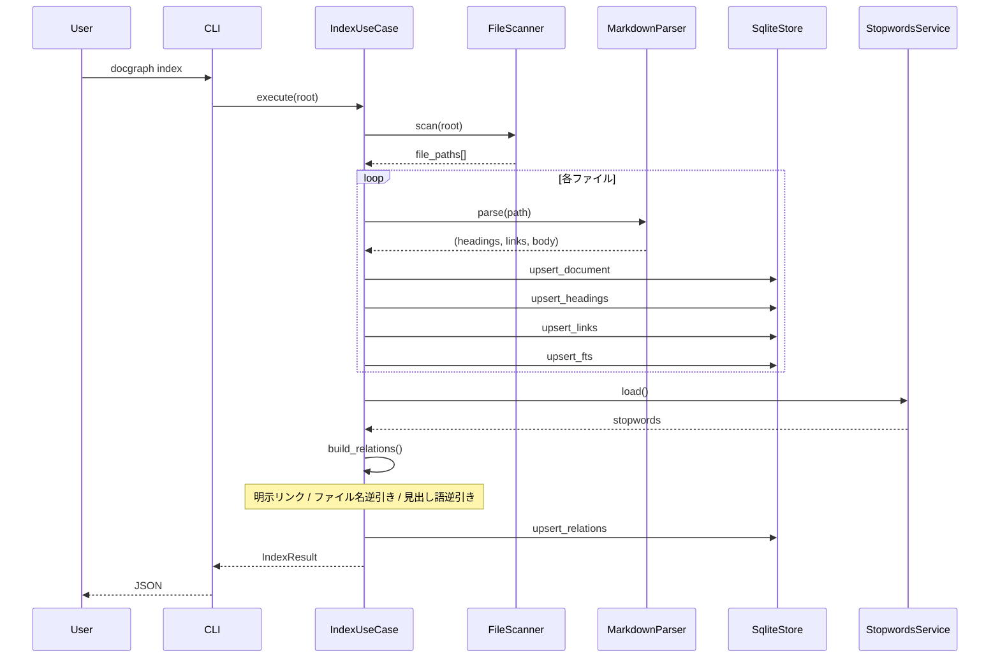
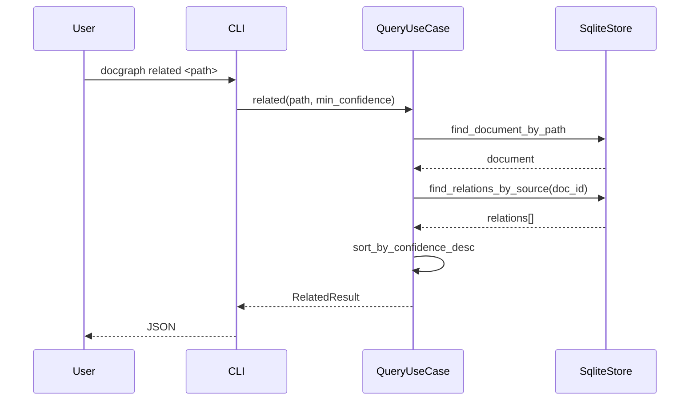

# DocGraph アーキテクチャ

- 対象: DocGraph v0.1.0（MVP-0）
- 最終更新: 2026-07-15

---

## 1. 設計方針

### 1-1. 基本思想

- **AI が読みやすく、人が保守しやすい構造**を最優先とする
- DDD は目的化せず、AI-DLC を成立させる手段として採用
- 1 ファイル 300 行以内 / 1 メソッド 15 行以内を目安（「God-Class Killer」ポリシー準拠）
- テスト容易性 = 依存を外から注入できる構造

### 1-2. 選定技術

| 分類 | 技術 | 選定理由 |
|---|---|---|
| 言語 | Python 3.12+ | 静的解析・埋め込み処理・データ処理の生産性 |
| パッケージ管理 | uv | 高速・pyproject.toml ネイティブ・仮想環境管理統合 |
| CLI | Typer | Click ベースで型ヒントから自動生成 |
| Markdown | markdown-it-py | AST 取得可能・行番号保持 |
| DTO | Pydantic v2 | バリデーション + JSON シリアライズ |
| DB | SQLite + FTS5 | 単一ファイル・全文検索組込・追加依存なし |
| glob | pathspec | `.gitignore` 準拠のパターンマッチ |
| Lint | Ruff | 高速・設定シンプル |
| 型検査 | mypy strict | 誤り早期検出 |
| テスト | pytest + pytest-cov | デファクト |

---

## 2. レイヤードアーキテクチャ

### 2-1. 依存方向

```
Domain（内） < Application < Infrastructure / Interface（外）
```

依存性逆転の原則により、外側は内側に依存するが、内側は外側を知らない。

### 2-2. レイヤ構成図



---

## 3. 各層の責務

### 3-1. Domain 層 (`src/docgraph/domain/`)

**役割**: 純粋なビジネスルールとエンティティの定義

**制約**:
- 環境依存インポート禁止（`sqlite3` / `pathlib.Path` の I/O / `open()` など）
- 標準ライブラリの型のみ許可（`dataclasses` / `enum` / `datetime` 等は可）
- 他レイヤへの依存禁止

**主要要素**:
- `Document`: ドキュメントエンティティ（id / path / hash / updated_at）
- `Heading`: 見出し値オブジェクト（level / text / line）
- `Link`: 明示リンク値オブジェクト（target_path / text / line）
- `Relation`: 関係エンティティ（source_id / target_id / reason / confidence / evidence_line）
- `Reason`: エッジ理由の Enum（`explicit_link` / `name_mention` / `heading_mention`）
- `Confidence`: 信頼度値オブジェクト（0.0〜1.0 の制約）

### 3-2. Application 層 (`src/docgraph/application/`)

**役割**: ユースケースの実行とビジネスロジックの調停

**制約**:
- 環境依存 API の直接インポート禁止
- 外部とのやり取りは `ports.py` のインタフェース経由に限定
- 依存性注入（DI）を前提とした構造

**主要要素**:
- `ports.py`: インフラ層への抽象インタフェース
  - `DocumentRepository`
  - `RelationRepository`
  - `SearchRepository`
  - `MarkdownParserPort`
  - `FileScannerPort`
- `IndexUseCase`: `docgraph index` の中核ロジック
- `QueryUseCase`: `docgraph related` / `docgraph search` の中核ロジック
- `StopwordsService`: 除外辞書のロードとマッチング

### 3-3. Infrastructure 層 (`src/docgraph/infrastructure/`)

**役割**: `ports.py` の具体実装、外部世界（DB / ファイルシステム）とのやり取り

**主要要素**:
- `SqliteStore`: SQLite 実装（Repository 群）
- `schema.sql`: SQLite スキーマ定義（マイグレーション込み）
- `MarkdownParser`: markdown-it-py ラッパ
- `FileScanner`: `pathspec` を使ったファイル列挙
- `ConfigLoader`: `docgraph.toml` の読込

### 3-4. Interface 層 (`src/docgraph/interface/`)

**役割**: CLI 入出力・出力フォーマット

**主要要素**:
- `cli.py`: Typer によるコマンド定義
- `formatters.py`: JSON / text 出力

---

## 4. データモデル（SQLite）

### 4-1. ER 図



### 4-2. インデックス

- `documents(path)` UNIQUE
- `documents(hash)` INDEX
- `headings(doc_id)` INDEX
- `links(doc_id)` INDEX
- `relations(source_id)` INDEX
- `relations(target_id)` INDEX
- `relations(source_id, target_id, reason)` UNIQUE（重複エッジ防止）

### 4-3. FTS5

- トークナイザ: `unicode61 remove_diacritics 2`
- 日本語検索は 2-gram フォールバックを検討（実データで判断）
- BM25 スコアで検索結果ソート

---

## 5. 処理フロー

### 5-1. `docgraph index`



### 5-2. `docgraph related <path>`



---

## 6. 依存性注入

- `interface/cli.py` で全ての依存を組み立てる（Composition Root）
- ユースケースは `ports.py` のプロトコル型を受け取る
- テストはモックを注入して純粋にユニットテスト可能

例:

```python
# interface/cli.py 内
store = SqliteStore(db_path)
parser = MarkdownParser()
scanner = FileScanner(gitignore=".gitignore")
stopwords = StopwordsService(paths=config.stopwords.files)

index_uc = IndexUseCase(
    scanner=scanner,
    parser=parser,
    document_repo=store,
    relation_repo=store,
    search_repo=store,
    stopwords=stopwords,
)
```

---

## 7. テスト戦略

| レイヤ | テスト種別 | ツール |
|---|---|---|
| Domain | ユニットテスト（純粋関数・エンティティ制約） | pytest |
| Application | ユースケーステスト（モック注入） | pytest + unittest.mock |
| Infrastructure | 統合テスト（実 SQLite / tmp path） | pytest + tmp_path fixture |
| E2E | CLI 経由の統合テスト | pytest + typer.testing.CliRunner |

カバレッジ目標: 80% 以上

---

## 8. ディレクトリ構造（実装後）

```
src/docgraph/
├── __init__.py
├── domain/
│   ├── __init__.py
│   ├── document.py
│   ├── heading.py
│   ├── link.py
│   ├── relation.py
│   └── confidence.py
├── application/
│   ├── __init__.py
│   ├── ports.py
│   ├── index_usecase.py
│   ├── query_usecase.py
│   └── stopwords_service.py
├── infrastructure/
│   ├── __init__.py
│   ├── sqlite_store.py
│   ├── schema.sql
│   ├── markdown_parser.py
│   ├── file_scanner.py
│   └── config_loader.py
└── interface/
    ├── __init__.py
    ├── cli.py
    └── formatters.py
```

---

## 9. 拡張性の担保

Phase 1 以降で追加されるパーサ（docx / xlsx / pptx / pdf）は、`ports.py` の `MarkdownParserPort` を汎化した `DocumentParserPort` に差し替え、パーサレジストリで拡張子↔パーサをマップする設計に発展させる。

`SqliteStore` は将来 `PostgresStore` に差し替え可能（`ports.py` の Repository を実装するだけ）。

---

## 10. 決定事項ログ

| 日付 | 決定 | 根拠 |
|---|---|---|
| 2026-07-15 | Python 3.12+ | 型ヒント成熟・生産性 |
| 2026-07-15 | uv 採用 | pyproject.toml ネイティブ・高速 |
| 2026-07-15 | SQLite + FTS5 | 単一ファイル・追加依存なし |
| 2026-07-15 | Typer 採用 | 型ヒントから CLI 自動生成 |
| 2026-07-15 | DDD レイヤ 4 分割 | AI 認知しやすさ・テスト容易性 |
| 2026-07-15 | 意味類似は MVP-0 に含めない | 1 日で立ち上げるための絞り込み |
