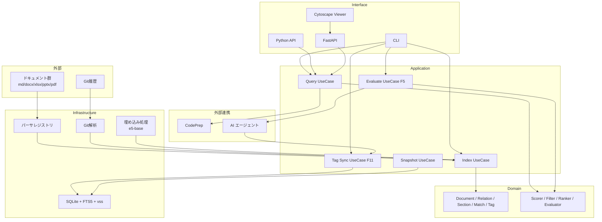

# DocGraph 最終ゴール要件定義書 v0.2

- 作成日: 2026-07-15
- 作成者: 木村
- 位置付け: MVP-0 リリース後の拡張ロードマップおよび全体像
- 対象読者: PJ メンバー / PMO / 将来の横展開担当

---

## 0. 最終ゴール（一言）

**「散在するプロジェクトドキュメント群を、機械的に関係付け・評価し、正の資産として育て続けるための基盤」**

---

## 1. ビジョン

### 1-1. 到達したい姿

```
現在: ドキュメントが散在、関係が暗黙、AI 投入時に取りこぼす
   ↓
MVP-0: 静的解析で関連が取れる、CodePrep と連携できる
   ↓
Phase 1: 意味類似・Git 挙動を含めた 5 軸評価で候補提示
   ↓
Phase 2: タグ埋め込みで暗黙リンクを明示化、DB を真実源として資産化
   ↓
最終: プロジェクト横断で「正の資産」として運用され、AI-DLC の標準基盤になる
```

### 1-2. 差別化ポジション

DocGraph は AI エージェントの代替ではなく **「AI を賢く使うための前処理エンジン」** として位置付ける。

| 責務 | 担当 |
|---|---|
| 静的関係抽出・累積・差分検知 | DocGraph |
| 意味判定・矛盾判定・要約 | AI エージェント |
| コンテキストパッキング | CodePrep |

---

## 2. フェーズ計画

| Phase | 期間目安 | スコープ | 主目的 |
|---|---|---|---|
| MVP-0 | 1 日 | md のみ / 明示リンク / 逆引き / キーワード検索 | ジュニアの取りこぼし防止 |
| Phase 1 | 2〜3 週 | docx/xlsx/pptx/pdf 対応 / 意味類似 / Git 挙動 / 5 軸評価器 | 関係候補の精度向上 |
| Phase 2 | 2〜3 週 | タグ埋め込み / DB プロジェクション / 承認フロー | ドキュメント資産化 |
| Phase 3 | 未定 | スナップショット差分 / 可視化 / HTTP API / マルチプロジェクト | PMO 報告 / 横展開 |

---

## 3. 全体機能一覧

### F1. ドキュメント収集（拡張）

| ID | 要件 | Phase |
|---|---|---|
| F1-01 | Markdown 対応 | MVP-0 |
| F1-02 | `.gitignore` 尊重 | MVP-0 |
| F1-03 | 除外 glob 設定 | MVP-0 |
| F1-04 | docx 対応 | Phase 1 |
| F1-05 | xlsx 対応 | Phase 1 |
| F1-06 | pptx 対応 | Phase 1 |
| F1-07 | pdf 対応（テキストレイヤ） | Phase 1 |
| F1-08 | Shift-JIS / CP932 対応 | Phase 1 |
| F1-09 | パーサレジストリ（拡張子↔パーサのマップを外付け化） | Phase 1 |
| F1-10 | Git rename 検出によるパス自動追従 | Phase 2 |
| F1-11 | シンボリックリンク追跡（設定切替） | Phase 3 |

### F2. パース（拡張）

| ID | 要件 | Phase |
|---|---|---|
| F2-01 | Markdown 見出し・リンク・Wiki リンク | MVP-0 |
| F2-02 | コードブロック除外 | MVP-0 |
| F2-03 | docx 段落・見出し・表・ハイパーリンク | Phase 1 |
| F2-04 | xlsx シート・セル・名前付き範囲・セル内リンク | Phase 1 |
| F2-05 | pptx タイトル・本文・ノート | Phase 1 |
| F2-06 | pdf テキストレイヤ | Phase 1 |
| F2-07 | 位置情報の正規化（行・page・cell・slide） | Phase 1 |

### F3. 関係抽出（拡張）

| ID | 要件 | Phase |
|---|---|---|
| F3-01 | 明示リンク抽出 | MVP-0 |
| F3-02 | ファイル名逆引き | MVP-0 |
| F3-03 | 見出し語逆引き | MVP-0 |
| F3-04 | 除外辞書 / ストップワード | MVP-0 |
| F3-05 | キーワード共起（TF-IDF / C-value） | Phase 1 |
| F3-06 | Git 共変更（PMI / Jaccard） | Phase 1 |
| F3-07 | 意味類似（multilingual-e5-base） | Phase 1 |
| F3-08 | エッジ `source` タグ: explicit / name / heading / keyword / co_change / semantic | Phase 1 |
| F3-09 | 全エッジに confidence と evidence 保持 | Phase 1 |

### F5. 関係候補評価器（新規・Phase 1 の中核）

| ID | 要件 | Phase |
|---|---|---|
| F5-01 | 5 軸評価スコア算出 | Phase 1 |
| F5-02 | 軸1: 共通語彙の分布（TF-IDF ランク・登場密度） | Phase 1 |
| F5-03 | 軸2: 構造的近接性（見出し内・本文冒頭・脚注） | Phase 1 |
| F5-04 | 軸3: 双方向性（A→B と B→A の有無） | Phase 1 |
| F5-05 | 軸4: メタデータ整合（tag / ディレクトリ / 担当者） | Phase 1 |
| F5-06 | 軸5: Git 挙動（共変更・コミットメッセージ共通語） | Phase 1 |
| F5-07 | 各軸の重みは設定ファイルで調整可能 | Phase 1 |
| F5-08 | 統合スコアと verdict（strong / moderate / weak）を出力 | Phase 1 |
| F5-09 | evidence として共通語彙のマッチ行と周辺コンテキストを含める | Phase 1 |
| F5-10 | しきい値ベースの自動承認モード | Phase 2 |
| F5-11 | キャリブレーションコマンド（正解データからの重みチューニング） | Phase 2 |

### F6. Query（拡張）

| ID | 要件 | Phase |
|---|---|---|
| F6-01 | `related <path>`（1 ホップ） | MVP-0 |
| F6-02 | `search <keyword>`（FTS5） | MVP-0 |
| F6-03 | `related --depth N`（N ホップ推移閉包） | Phase 1 |
| F6-04 | エッジタイプフィルタ | Phase 1 |
| F6-05 | 信頼度閾値フィルタ | Phase 1 |
| F6-06 | 孤立ノード一覧 | Phase 1 |
| F6-07 | 重複候補一覧（意味類似度） | Phase 1 |
| F6-08 | 矛盾候補一覧（同一キーワード + 数値差分） | Phase 2 |
| F6-09 | 正候補ランキング（被参照数・更新頻度・記述量） | Phase 2 |
| F6-10 | Python API 提供 | Phase 1 |
| F6-11 | 軽量 HTTP（FastAPI）モード | Phase 3 |

### F7. スナップショット・差分（Phase 3）

| ID | 要件 | Phase |
|---|---|---|
| F7-01 | `snapshot create <tag>` | Phase 3 |
| F7-02 | `snapshot diff <a> <b>` | Phase 3 |
| F7-03 | 差分レポートを Markdown 出力 | Phase 3 |
| F7-04 | 世代上限管理（既定 10 世代）と手動 pin | Phase 3 |

### F8. 分析レポート（Phase 1〜2）

| ID | 要件 | Phase |
|---|---|---|
| F8-01 | 孤立ドキュメントレポート | Phase 1 |
| F8-02 | 重複候補レポート | Phase 1 |
| F8-03 | 矛盾候補レポート | Phase 2 |
| F8-04 | 影響波及レポート | Phase 1 |
| F8-05 | 出力形式: Markdown / CSV / JSON | Phase 1 |

### F9. 可視化（Phase 3）

| ID | 要件 | Phase |
|---|---|---|
| F9-01 | Web ベースの読取専用ビューア（Cytoscape.js） | Phase 3 |
| F9-02 | ノード / エッジの色分け | Phase 3 |
| F9-03 | フィルタリング・検索 | Phase 3 |
| F9-04 | エッジクリックで根拠位置表示 | Phase 3 |

### F10. CodePrep 連携（拡張）

| ID | 要件 | Phase |
|---|---|---|
| F10-01 | 関連パス JSON 出力 | MVP-0 |
| F10-02 | パイプ連携 | MVP-0 |
| F10-03 | 周辺コンテキスト付き JSON 出力（トークン推定値込み） | Phase 1 |
| F10-04 | 型定義パッケージ `@docgraph/contract` の提供 | Phase 2 |

### F11. タグ埋め込み・DB プロジェクション（Phase 2 の中核）

| ID | 要件 | Phase |
|---|---|---|
| F11-01 | すべての関係タグは DB を単一の真実源とする | Phase 2 |
| F11-02 | タグ形式は HTML コメント `<!-- docgraph:ref id=... target=... -->` | Phase 2 |
| F11-03 | タグに DB 主キー・target・type・confidence を含める | Phase 2 |
| F11-04 | ステータス: pending / approved / applied / deleted / orphaned | Phase 2 |
| F11-05 | `refs sync` で DB → 本文へ一括投影 | Phase 2 |
| F11-06 | 本文直編集で削除されたタグは `orphaned` として検知 | Phase 2 |
| F11-07 | `refs approve` / `refs revoke` の複数 ID バッチ実行 | Phase 2 |
| F11-08 | 埋め込み位置指定（マッチ行直後 / セクション末尾） | Phase 2 |
| F11-09 | ドライラン（`--dry-run`）で差分プレビュー | Phase 2 |
| F11-10 | 対象は Markdown のみ（docx/xlsx/pptx への書き戻しはやらない） | Phase 2 |
| F11-11 | 週次乖離レポート（`refs audit`） | Phase 2 |

### F12. キーワード統合検索（Phase 1）

| ID | 要件 | Phase |
|---|---|---|
| F12-01 | 明示リンク + キーワード + 意味類似の統合ランキング検索 | Phase 1 |
| F12-02 | 入力は事前分解済みキーワード（自然言語分解は AI 側の責務） | Phase 1 |
| F12-03 | 結果はパス一覧 + 該当セクション見出し | Phase 1 |
| F12-04 | 統合スコアの重みは設定ファイルで調整可能 | Phase 1 |

---

## 4. 全体アーキテクチャ（最終形）



---

## 5. 成功基準（G-1 〜 G-7）

| ID | 成功基準 | 測定方法 | 目標時期 |
|---|---|---|---|
| G-1 | 関連パス取得を 500ms 以内で返す | Query 応答時間 | MVP-0 |
| G-2 | 1 万ファイル規模のフルインデックスを 10 分以内 | index 実行時間 | Phase 1 |
| G-3 | インクリメンタル 100 ファイル / 30 秒以内 | 更新時間 | Phase 1 |
| G-4 | 孤立ドキュメントを 1 コマンドで一覧化 | 機能実装 | Phase 1 |
| G-5 | AI 呼び出しコストを従来比 1/10 以下 | パッキング後トークン数 | Phase 1 |
| G-6 | 3 ヶ月運用後、明示リンク率 60% 以上 | 明示 / (明示 + 暗黙) | Phase 2 |
| G-7 | 同一トピックの正ドキュメント特定率 90% 以上 | 抜き取り評価 | Phase 3 |

---

## 6. 制約・前提

| ID | 内容 |
|---|---|
| C-01 | 対象はローカルディスク上のドキュメントに限る |
| C-02 | 埋め込みモデルはローカル実行モデルに限定 |
| C-03 | ドキュメント本文を外部送信しない |
| C-04 | SharePoint 上の正本には書き戻さない（PR ベース運用は将来検討） |
| C-05 | Git 挙動評価は履歴 N ヶ月以上のプロジェクトでのみ有効 |
| C-06 | PDF は OCR 済みテキストレイヤを持つものを対象 |

---

## 7. リスク

| ID | リスク | 対策 |
|---|---|---|
| R-01 | 暗黙リンクの偽陽性爆発 | ストップワード / 最小マッチ長 / 信頼度閾値 |
| R-02 | 大量コミットの共変更ノイズ | ファイル数上限 / 時間窓 |
| R-03 | 意味類似の非決定性 | モデルバージョン固定 / config_hash |
| R-04 | 文字コード判定失敗 | chardet + フォールバック + 手動オーバライド |
| R-05 | スコープ膨張 | Phase 単位でリリース、可視化は最後 |
| R-06 | CodePrep との契約ずれ | `@docgraph/contract` を単一真実源に |
| R-07 | タグ埋め込みの事故 | Markdown 限定 / ドライラン必須 / DB プロジェクション徹底 |
| R-08 | 現場で使われない | AI-DLC 標準手順に組み込み / 詳細設計チェックリスト必須化 |

---

## 8. 将来の拡張候補（現時点では判断保留）

- BusinessFlow ノード（DOM-XX 業務パターンマトリクス連携）
- OCR 対応（スキャン PDF）
- SharePoint / Teams からの直接取り込み
- マルチプロジェクト横断検索
- Neo4j 等のグラフ DB への差し替え（大規模化した場合）
- 生成 AI との連携パイプライン（矛盾検出・正ドキュメント再構成）
